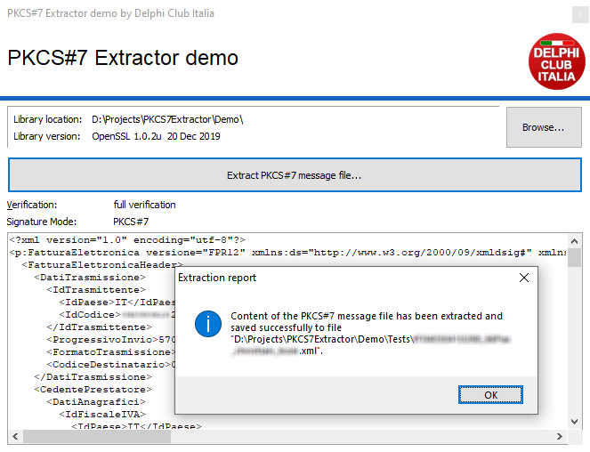

[versione italiana - italian version](LEGGIMI.md)


# PKCS#7 Extractor library for Delphi / Free Pascal / Lazarus

This project is born from the need to simply extract .P7M files content in Delphi / Free Pascal / Lazarus applications.\
Starting January 1st, 2019 italian developers have faced the new centralized digital invoicing system which has become mandatory by law.\
Digital invoices are basically represented into XML files that are then digitally signed using CAdES-BES mode.\
Developers managing invoices need to generate those XMLs and be able to read them back, but when a digitally signed invoice is enveloped into a .P7M file many of them ended up stripping it down by finding the position of the opening XML tag and the closing tag and then copying that part of the file.\
We thought this couldn't be the professional way of managing this task, so we started investigating and we ended up creating this work.

## Summary

  - [PKCS#7 Extractor library for Delphi / Free Pascal / Lazarus](#pkcs7-extractor-library-for-delphi-free-pascal-lazarus)
  - [Summary](#summary)
  - [Included files](#included-files)
     - [PKCS7Extractor.pas](#pkcs7extractorpas)
       - [What it is and how does it work](#what-it-is-and-how-does-it-work)
       - [Exported functions](#exported-functions)
       - [Exported class](#exported-class)
         - [OnStreamCreate event](#onstreamcreate-event)
  - [Sample application](#sample-application)
  - [Unit tests](#unit-tests)
    - [Save a tests report](#save-a-tests-report)
    - [Get a list of the OpenSSL libraries](#get-a-list-of-the-openssl-libraries)
    - [Run test only on certain versions of OpenSSL](#run-test-only-on-certain-versions-of-openssl)
  - [Required files](#required-files)
  - [Version history](#version-history)
  - [Compiler compatibility](#compiler-compatibility)
  - [Projects for the future](#projects-for-the-future)
  - [Thanks](#thanks)
  - [Comments](#comments)

## Included files

### [PKCS7Extractor.pas](Source/PKCS7Extractor.pas)
### What it is and how does it work
This is the main unit developers will deal with. It exports some useful functions to deal with PKCS#7 messages.
This is a wrapper for the [OpenSSL](https://www.openssl.org)'s Libeay32.dll file. Please keep in mind that this is a minimal wrapper written to include only the functions required for PKCS#7 extraction and it's not intended to become a full wrapper.\
It also does not work like a regular wrapper: when loaded it it first searches for already present instances of the library and attaches to that, if library is not currently in memory it will try to load it like a normal wrapper would do.\
But when unloaded this wrapper will only clear it's variables and will not free loaded library from memory. This was designed in this way because this shouldn't be used as a main source for [OpenSSL](https://www.openssl.org) interfacing and considering that other components/libraries could be present in the application unloading the library could drive to catastrophic results.\
This behaviour will be safe for working along to others' works.

### Exported functions
Every exported function has an history so long nobody would believe us. So let be clear, this was not so easy after all, but now it will be easy to go as follows. Let's begin decribe the functions for the wrapper of [OpenSSL](https://www.openssl.org) functions.

```delphi
function Load: Boolean;
```
Call the `Load` function to initialize the wrapper, this will eventually cause the load of the library. If a valid folder was specified using the `SetFolder` procedure, it will try to load the library from that folder.\
The return value represents the successfull attach to the library or the load of the library and involves it's functions being found.
Calling this more times will have no results as long as the library resides in memory.

```delphi
function Loaded: Boolean;
```
Returns if the wrapper is currently correctly initialized.

```delphi
procedure Unload;
```
The `Unload` procedure causes the wrapper to be uninitialized but, as said before, the library will be left loaded in memory.

```delphi
procedure SetFolder(const S: String);
```
Call `SetFolder` prior of the `Load` to set the folder where to load the library. Note that when the library has already been loaded from this wrapper or from another component/library calls to this function will have no effect at all.\
If an invalid folder has been specified or the library is not found in the folder, normal system paths priority will be used to load the library.\
Does not have effect when library is statically linked into executable.

```delphi
function GetFolder: String;
```
Function `GetFolder` will return the absolute path of the library being actually loaded into memory or an empty string if the library was not loaded.\
This can differ from the folder specified by `SetFolder` when the specified folder is invalid or the library is not found in the folder.

```delphi
function GetVersion: String;
```
Utility function `GetVersion` does simply return the string containing the library version or an empty string if the wrapper has not been initialized.\
The corresponding function has been introduced since [OpenSSL](https://www.openssl.org) version 0.9.7, hence this function will return empty with older versions.

```delphi
function GetErrorCode: Cardinal;
```
Returns a numeric value representing last OpenSSL library internal error.

```delphi
function GetError(const ErrorCode: Cardinal): String;
```
Returns the description of a given error code.

```delphi
function GetError: String;
```
Returns the description of last OpenSSL library internal error./
/
Before continuing, let's take a look at two fundamental types.

```delphi
  TVerifyStatus = (vsUnknown, vsFull, vsPartial);
```

|Value|Description|
|--|--|
|`vsUnknown`|No data was loaded or data was invalid.|
|`vsPartial`|Data and envelope has been verified.|
|`vsFull`|A full verification has been made.|

```delphi
  TSignatureMode = (smUnknown, smPKCS7, smCMS);
```

|Value|Description|
|--|--|
|`smUnknown`|No data was loaded or data was invalid.|
|`smPKCS7`|Data has been loaded using PKCS#7 functions.|
|`smCMS`|Data has been loaded using CMS functions.|

What follows are the utility functions.

```delphi
function Extract(InStream, OutStream: TStream): Boolean;
```
Given a PKCS#7 message in a stream outputs the content extracted to the output stream.\
Returns if the operation was successful.\
Please keep in mind that `InStream.Position` has to be set to the beginning of the PKCS#7 data prior to calling this function for this to work. The `Position` property will be at the end of the stream once this returns, also when the function doesn't produce a positive result.\
The resulting data - if any - is appended to the current content of the output stream, that needs to be cleared before being passed to this function to only receive the content extracted.

```delphi
function Extract(InFilename, OutFilename: String): Boolean;
```
Overloaded function that will extract from a source PKCS#7 message file to a output file and return if the operation was successful or not.

```delphi
function Extract(Filename: String): Boolean;
```
Extracts the content of the PKCS#7 message file using as output file the guessed destination filename. It will return if the operation was successful or not. Keep in mind that if the destination filename can't be guessed, the operation will fail.\
To see how the filename is guessed look at the `GuessFilename` function below.

```delphi
function GuessFilename(Filename: String): String;
```
Tries to guess the destination filename from a given original filename, which means: remove the appended ".p7m" extensions from the file.\
To check if this extension was appended instead of replaceing the original one, if the resulting filename does not contain another extension, the function will fail and return the original file name.

```delphi
function Verify(Stream: TStream): TVerifyStatus;
```
Utility function to check if a given stream does contain a valid PKCS#7 message. As for `Extract(TStream, TStream)` please keep in mind that input stream `Position` property must be set to the beginning of the PKCS#7 message prior to calling this.\
Unlike `Extract(TStream, TStream)` however, this function will preserve stream position to it's current state.

```delphi
function Verify(Filename: String): TVerifyStatus;
```
Simply checks if given file contains a valid PKCS#7 message.

```delphi
function Extract(Stream: TStream; var S: String): Boolean;
```
Utility function to have the content of a PKCS#7 message extracted from a stream and put directly into a string. If the operation fails the return value will be `false` and an empty string will be set.

```delphi
function ExtractToString(Filename: String; var S: String): Boolean;
```
Utility function to have the content of a PKCS#7 message extracted from a file and put directly into a string. If the operation fails the return value will be `false` and an empty string will be set.

```delphi
function SignatureMode(Stream: TStream): TSignatureMode; overload;
```

Returns the crypto functions type used for enveloping data. Preserves value of the `Position` property of the stream.

```delphi
function SignatureMode(const Filename: String): TSignatureMode; overload;
```

Returns the crypto functions type used for enveloping a file.

### Exported class

This unit exports a handle class `TPKCS7Message` that is the main core where the job is done. If you prefeer to deal with this, here's how it works. Please be advised that unlike utilities functions above, this class does not try to initialize the wrapper by itself, so always remember to call `Load()` before using this.

```delphi
constructor TPKCS7Message.Create;
```

Creates an instance of the class.

```delphi
procedure TPKCS7Message.Clear;
```

Clears all whe local variables discarding eventually loaded data.

```delphi
function TPKCS7Message.LoadFromStream(Stream: TStream): Boolean;
```

Loads a PKCS#7 message from a stream, returns `True` on success.

```delphi
function TPKCS7Message.LoadFromFile(Filename: String): Boolean;
```

Loads a PKCS#7 message file, returns `True` on success.

```delphi
function TPKCS7Message.SaveToStream(Stream: TStream): Boolean;
```

Saves content previously loaded with `LoadFromStream` or `LoadFromFile` methods to a stream, returns `True` on valid data.

```delphi
function TPKCS7Message.SaveToFile(Filename: String): Boolean;
```

Saves content previously loaded with `LoadFromStream` or `LoadFromFile` methods to a file, returns `True` on valid data.

```delphi
property SignatureMode: TSignatureMode;
```

Read-only property representing the crypto functions type used for enveloping data.

```delphi
property VerifyStatus: TVerifyStatus;
```

Read-only property representing the verification mode used for data.

#### OnStreamCreate event

The class extracts the whole content from the data and stores it to temporary memory inside the `LoadFromStream` or `LoadFromFile` functions.
We chose to store that data in the RAm memory by using a `TMemoryStream` because the initial target of this class were small files.
It's possible to redirect that data to other destinations, for this reason an event has been introduces, which gets called when the class needs to allocate space.
In this way a redirection to every writable `TStream` descendant is possible.

```delphi
property OnStreamCreate: TStreamCreateEvent;
```

As an example, we could define an event on out Form to save it to a temporary file.

```delphi
type
  TMyForm = class(TForm)
    ...
    procedure FormCreate(Sender: TObject);
  private
    FPKCS7Message: TPKCS7Message;
  protected
    procedure PKCS7Stream(Sender: TObject; var AStream: TStream);
    ...

...
procedure TMyForm.PKCS7Stream(Sender: TObject; var AStream: TStream);
begin
  AStream := TFileStream.Create('temp.tmp', fmCreate or fmOpenReadWrite or fmShareDenyWrite)
end;

...

procedure TMyForm.FormCreate(Sender: TObject);
begin
  FPKCS7Message := TPKCS7Message.Create;
  FPKCS7Message.OnStreamCreate := PKCS7Stream;
...
end;
...
```

The class will call the `Free` method of the stream when this is not longer necessary.

ADDENDUM: in the "Utils" folder you can find the file [CCLib.TempFileStream.pas](Utils/CCLib.TempFileStream.pas) which is not part ot this library but freely available.
It simply exports a `TStream` descendant class that creates a temporary file in system's temporary folder with a randomic filename, denying access to the file to other applications.
This file will be automatically deleted once the `Free` method is called.

## Sample application

The sample application contained into `Demo` folder is a simple extractor which allows to change the folder where the [OpenSSL](https://www.openssl.org) libraries are loaded from and pick up a file, extract it to destination file and view it's contents into a `TMemo`.



## Unit tests

The unit tests contained in `Tests` folder is a console application project that will run a whole serie of test on the library and the wrapper.

The software requires some folders and files to be in the same folder from where the compiled executable is run from, here's the list of the folders and what they need to contain.

| Folder name | Required? | Description |
|--|--|--|
| Data | YES | This need to contain a bunch of files on whose the tests will be executed.
| DataCheck  | YES | In this folder there must be expected results from the extraction of the files in the "Data" folder. Each file must have the exact filename and extension of the source file. **Tests will be executed only on files that have a correspondence in the two folders above.**
| OpenSSL\x32  | NO* | This folder should contain subfolders each of whose contains the [OpenSSL](https://www.openssl.org) libraries in binary form. Tests will be executed for each folder found. **Only put 32-bit libraries inside this folder** 
| OpenSSL\x64  | NO* | Same as the above, but for the 64-bit libraries.
| Temp  | NO** | This folder is used while executing tests for saving some files. **Do not put files inside this folder**, this folder will be deleted each time the tests are run.

###   
||Addendum|
|---------------|--|
|*               | This folder is required only when application is compiled for the corrisponding architecture. |
|**               | This folder will be created automatically by the software each time it is run. 

### Save a tests report
To save a tests report to a text file for further investigation - or just to stop wasting time scrolling the console - the use of output redirection comes handy.

     PKCS7ExtractorTest.exe >report.txt
Will generate a text file called "report.txt" containing all the information needed.
### Get a list of the OpenSSL libraries
To obtain a list of the [OpenSSL](https://www.openssl.org) libraries in the `.\OpenSSL\x32` and `.\OpenSSL\x64` folders the tests program can be run as:  

     PKCS7ExtractorTest.exe /list

This will cause the program to only output a list of the libraries versions it is able to load. To save this list to a text file simply use output redirection by running the command:

     PKCS7ExtractorTest.exe /list >output.txt
This will generate a file named "output.txt".

### Run test only on certain versions of OpenSSL
Having a lot of different version of [OpenSSL](https://www.openssl.org) libraries in the `.\OpenSSL` folder in sub-folders we ended up losing a lot of time running tests for certain versions. For this reason we implemented a way to specify which versions to run.\
Just run the command specifying the folders names where to load from, for example:

     PKCS7ExtractorTest.exe 0.9.6 openssl-0.9.8x-i386-win32 "openssl latest"
Will execute tests only on the folders named "0.9.6", "openssl-0.9.8x-i386-win32" and "openssl latest".

## Required files

This project only requires [GNU Win32/64](http://gnuwin32.sourceforge.net/packages/openssl.htm) binary libraries for Windows.
Minimum supported version should be 0.9.6 released on September, 24th 2000. We're unable to test binaries before this version.\
Starting from version 1.1.0  [OpenSSL](https://www.openssl.org) libraries had a mayor rewrite and we're currently investigatin on how to maker this libary compatible with both versions. We don't guarantee this will be possible in the future.

This unit has been tested with these binary versions:

| Version | Released | x86 | x64 | Notes |
|---------|----------|-----|-----|-------|
| 0.9.6 | 24 Sep 2000 | :white_check_mark: | *N/A* |  |
| 0.9.6b | 9 Jul 2001 | :white_check_mark: | *N/A* |  |
| 0.9.6i | ??? | ??? | ??? | searching for this |
| 0.9.6j | ??? | ??? | ??? | searching for this |
| ~~0.9.6k~~ | ~~30 Sep 2003~~ | ~~NO~~ | *N/A* | **CURRENTLY INVESTIGATING THIS ISSUE** |
| 0.9.6l | ??? | ??? | ??? | searching for this |
| ~~0.9.6m~~ | ~~17 Mar 2004~~ | ~~NO~~ | *N/A* | **CURRENTLY INVESTIGATING THIS ISSUE** |
| 0.9.7 | ??? | ??? | ??? | searching for this |
| 0.9.7a | ??? | ??? | ??? | searching for this |
| 0.9.7b | ??? | ??? | ??? | searching for this |
| 0.9.7c | ??? | ??? | ??? | searching for this |
| 0.9.7d | ??? | ??? | ??? | searching for this |
| 0.9.7e | ??? | ??? | ??? | searching for this |
| 0.9.7f | ??? | ??? | ??? | searching for this |
| 0.9.7g | ??? | ??? | ??? | searching for this |
| 0.9.7h | ??? | ??? | ??? | searching for this |
| 0.9.7i | ??? | ??? | ??? | searching for this |
| ~~0.9.7j~~ | ~~04 May 2006~~ | ~~NO~~ | *N/A* | **CURRENTLY INVESTIGATING THIS ISSUE** |
| 0.9.7k | ??? | ??? | ??? | searching for this |
| 0.9.7l | ??? | ??? | ??? | searching for this |
| ~~0.9.7m~~ | ~~23 Feb 2007~~ | ~~NO~~ | *N/A* | **CURRENTLY INVESTIGATING THIS ISSUE** |
| 0.9.8 | ??? | ??? | ??? | searching for this |
| 0.9.8a | ??? | ??? | ??? | searching for this |
| 0.9.8b | ??? | ??? | ??? | searching for this |
| 0.9.8c | ??? | ??? | ??? | searching for this |
| 0.9.8d | ??? | ??? | ??? | searching for this |
| 0.9.8e | 23 Feb 2007 | :white_check_mark: | *N/A* |  |
| 0.9.8f | ??? | ??? | ??? | searching for this |
| 0.9.8g | ??? | ??? | ??? | searching for this |
| 0.9.8h | 28 May 2008 | :white_check_mark: | :white_check_mark: |  |
| 0.9.8h | 28 May 2008 | :white_check_mark: | *N/A* | Indy / IntraWeb Edition |
| 0.9.8i | 15 Sep 2008 | :white_check_mark: | :white_check_mark: |  |
| 0.9.8j | 07 Jan 2009 | :white_check_mark: | :white_check_mark: |  |
| 0.9.8k | 25 Mar 2009 | :white_check_mark: | :white_check_mark: |  |
| 0.9.8l | 5 Nov 2009 | :white_check_mark: | :white_check_mark: |  |
| 0.9.8l | 5 Nov 2009 | :white_check_mark: | *N/A* | Indy Backport |
| 0.9.8m | 25 Feb 2010 | :white_check_mark: | :white_check_mark: |  |
| 0.9.8n | ??? | ??? | ??? | searching for this |
| 0.9.8o | 01 Jun 2010 | :white_check_mark: | :white_check_mark: |  |
| 0.9.8p | ??? | ??? | ??? | searching for this |
| 0.9.8q | 2 Dec 2010 | :white_check_mark: | :white_check_mark: |  |
| 0.9.8r | 8 Feb 2011 | :white_check_mark: | :white_check_mark: |  |
| 0.9.8r | 8 Feb 2011 | :white_check_mark: | :white_check_mark: | rev.2 |
| 0.9.8s | 4 Jan 2012 | :white_check_mark: | :white_check_mark: |  |
| 0.9.8t | 18 Jan 2012 | :white_check_mark: | :white_check_mark: |  |
| 0.9.8u | 12 Mar 2012 | :white_check_mark: | :white_check_mark: |  |
| 0.9.8v | ??? | ??? | ??? | searching for this |
| 0.9.8w | 23 Apr 2012 | :white_check_mark: | :white_check_mark: |  |
| 0.9.8x | 10 May 2012 | :white_check_mark: | :white_check_mark: |  |
| 0.9.8y | 5 Feb 2013 | :white_check_mark: | :white_check_mark: |  |
| 0.9.8za | ??? | ??? | ??? | searching for this |
| 0.9.8zb | 6 Aug 2014 | :white_check_mark: | :white_check_mark: |  |
| 0.9.8zc | 15 Oct 2014 | :white_check_mark: | :white_check_mark: |  |
| 0.9.8zd | 8 Jan 2015 | :white_check_mark: | :white_check_mark: |  |
| 0.9.8ze | 15 Jan 2015 | :white_check_mark: | :white_check_mark: |  |
| 0.9.8zf | 19 Mar 2015 | :white_check_mark: | :white_check_mark: |  |
| 0.9.8zg | 11 Jun 2015 | :white_check_mark: | :white_check_mark: |  |
| 0.9.8zh | 3 Dec 2015 | :white_check_mark: | :white_check_mark: |  |
| 1.0.0 | 29 Mar 2010 | :white_check_mark: | :white_check_mark: |  |
| 1.0.0a | 1 Jun 2010 | :white_check_mark: | :white_check_mark: |  |
| 1.0.0b | ??? | ??? | ??? | searching fo this |
| 1.0.0c | 2 Dec 2010 | :white_check_mark: | :white_check_mark: |  |
| 1.0.0d | 8 Feb 2011 | :white_check_mark: | :white_check_mark: |  |
| 1.0.0d | 8 Feb 2011 | :white_check_mark: | :white_check_mark: | rev.2 |
| 1.0.0e | 6 Sep 2011 | :white_check_mark: | :white_check_mark: |  |
| 1.0.0f | 4 Jan 2012 | :white_check_mark: | :white_check_mark: |  |
| 1.0.0g | 18 Jan 2012 | :white_check_mark: | :white_check_mark: |  |
| 1.0.0h | 12 Mar 2012 | :white_check_mark: | :white_check_mark: |  |
| 1.0.0i | 19 Apr 2012 | :white_check_mark: | :white_check_mark: |  |
| 1.0.0j | 10 May 2012 | :white_check_mark: | :white_check_mark: |  |
| 1.0.0k | 5 Feb 2013 | :white_check_mark: | :white_check_mark: |  |
| 1.0.0l | 6 Jan 2014 | :white_check_mark: | :white_check_mark: |  |
| 1.0.0m | ??? | ??? | ??? | searching for this |
| 1.0.0n | 6 Aug 2014 | :white_check_mark: | :white_check_mark: |  |
| 1.0.0o | 15 Oct 2014 | :white_check_mark: | :white_check_mark: |  |
| 1.0.0p | 8 Jan 2015 | :white_check_mark: | :white_check_mark: |  |
| 1.0.0q | 15 Jan 2015 | :white_check_mark: | :white_check_mark: |  |
| 1.0.0r | 19 Mar 2015 | :white_check_mark: | :white_check_mark: |  |
| 1.0.0s | 11 Jun 2015 | :white_check_mark: | :white_check_mark: |  |
| 1.0.0t | 3 Dec 2015 | :white_check_mark: | :white_check_mark: |  |
| 1.0.1 | 14 Mar 2012 | :white_check_mark: | :white_check_mark: |  |
| 1.0.1a | ??? | ??? | ??? | searching for this |
| 1.0.1b | 26 Apr 2012 | :white_check_mark: | :white_check_mark: |  |
| 1.0.1c | 10 May 2012 | :white_check_mark: | :white_check_mark: |  |
| 1.0.1d | ??? | ??? | ??? | searching for this |
| 1.0.1e | 11 Feb 2013 | :white_check_mark: | :white_check_mark: |  |
| 1.0.1f | 6 Jan 2014 | :white_check_mark: | :white_check_mark: |  |
| 1.0.1g | 7 Apr 2014 | :white_check_mark: | :white_check_mark: |  |
| 1.0.1h | 5 Jun 2014 | :white_check_mark: | :white_check_mark: |  |
| 1.0.1i | 6 Aug 2014 | :white_check_mark: | :white_check_mark: |  |
| 1.0.1j | 15 Oct 2014 | :white_check_mark: | :white_check_mark: |  |
| 1.0.1k | 8 Jan 2015 | :white_check_mark: | :white_check_mark: |  |
| 1.0.1l | 15 Jan 2015 | :white_check_mark: | :white_check_mark: |  |
| 1.0.1m | 19 Mar 2015 | :white_check_mark: | :white_check_mark: |  |
| 1.0.1o | 12 Jun 2015 | :white_check_mark: | :white_check_mark: |  |
| 1.0.1p | 9 Jul 2015 | :white_check_mark: | :white_check_mark: |  |
| 1.0.1q | 3 Dec 2015 | :white_check_mark: | :white_check_mark: |  |
| 1.0.1r | 28 Jan 2016 | :white_check_mark: | :white_check_mark: |  |
| 1.0.1s | 1 Mar 2016 | :white_check_mark: | :white_check_mark: |  |
| 1.0.1t | 3 May 2016 | :white_check_mark: | :white_check_mark: |  |
| 1.0.1u | 22 Sep 2016 | :white_check_mark: | :white_check_mark: |  |
| 1.0.2 | 22 Jan 2015 | :white_check_mark: | :white_check_mark: |  |
| 1.0.2a | 19 Mar 2015 | :white_check_mark: | :white_check_mark: |  |
| 1.0.2b | 11 Jun 2015 | ??? | ??? | searching for this |
| 1.0.2c | 12 Jun 2015 | :white_check_mark: | :white_check_mark: |  |
| 1.0.2d | 9 Jul 2015 | :white_check_mark: | :white_check_mark: |  |
| 1.0.2e | 3 Dec 2015 | :white_check_mark: | :white_check_mark: |  |
| 1.0.2f | 28 Jan 2016 | :white_check_mark: | :white_check_mark: |  |
| 1.0.2g | 1 Mar 2016 | :white_check_mark: | :white_check_mark: |  |
| 1.0.2h | 3 May 2016 | :white_check_mark: | :white_check_mark: |  |
| 1.0.2i | 22 Sep 2016 | :white_check_mark: | :white_check_mark: |  |
| 1.0.2j | 26 Sep 2016 | :white_check_mark: | :white_check_mark: |  |
| 1.0.2k | 26 Jan 2017 | :white_check_mark: | :white_check_mark: |  |
| 1.0.2l | 25 May 2017 | :white_check_mark: | :white_check_mark: |  |
| 1.0.2m | 2 Nov 2017 | :white_check_mark: | :white_check_mark: |  |
| 1.0.2n | 7 Dec 2017 | :white_check_mark: | :white_check_mark: |  |
| 1.0.2o | 27 Mar 2018 | :white_check_mark: | :white_check_mark: |  |
| 1.0.2p | 14 Aug 2018 | :white_check_mark: | :white_check_mark: |  |
| 1.0.2q | 20 Nov 2018 | :white_check_mark: | :white_check_mark: |  |
| 1.0.2r | 26 Feb 2019 | :white_check_mark: | :white_check_mark: |  |
| 1.0.2s | 28 May 2019 | :white_check_mark: | :white_check_mark: |  |
| 1.0.2t | 10 Sep 2019 | :white_check_mark: | :white_check_mark: |  |
| 1.0.2u | 20 Dec 2019 | :white_check_mark: | :white_check_mark: |  |

Most of these binaries can be found at [indy.fulgan.com](https://indy.fulgan.com/SSL/Archive).\
We're currently looking for binaries not listed here so please let us know if there're some around, we'll be happy to add them to our tests.\
Every compatibility issues reported will be appreciated.
We decided to remove versions 1.1.0+ in this table, as well as beta versions which are not suitable for distribution.

## Version history

- Version 1.2.0.0 released March, 2nd 2020
  - added support for files signed using CMS cryptography (requires OpenSSL libraries 0.9.8h+)
  - now compatible with Lazarus / Free Pascal
  - lost compatibility with Delphi compiler prior to Delphi 6
  - all the magic has been moved to the LoadFromStream function removing a logical bug, less class variables are used now
  - TPKCS7Message.Verify has been replaced by property TPKCS7Message.VerifyStatus
  - new property TPKCS7Message.SignatureMode
  - new SignatureMode(Stream) and SignatureMode(String) utility functions
  - new event TPKCS7Message.OnStreamCreate allows to override default TStream descendant
  - Extract(Stream, S) and ExtractToString now manage BOMs and encodings (Delphi 2009+)
  - added functions GetErrorCode, GetError(Cardinal) e GetError
  - no need to specify verifications options anymore
  - doesn't leave an empty file while creating a new file with failing SaveToFile function
  - moved all the annoying structures definition in implementation
  - avoided a compiler hint on Delphi (still there are some in Lazarus / Free Pascal, but very odd)
  - added file [CCLib.TempFileStream.pas](Utils/CCLib.TempFileStream.pas)
  - tested on OpenSSL libraries versions 1.0.2q, 1.0.2r, 1.0.2s, 1.0.2t and 1.0.2u 
  - minor bugfixing and code refactoring, removed syntactic sugar
  - added batch file for automatic creation of test expected results
  - updated README.md, LEGGIMI.md and demo screenshot
  - restored DCI icon's file in the demo folder

- Version 1.0.0.0 released November, 27th 2018
  - first public release
  - minor bugfixes
  - code cleanup and commented
  - tested with more versions of OpenSSL binaries

- Version 0.9.5.0 - November, 26th 2018
  - bugfixes

- Version 0.9.3.0 - November, 25th 2018
  - verification now supports full signature method
  - added verification parameter to every function

- Version 0.9.0.0 - November, 25th 2018
  - changed structure of the library
  - only one file required
  - the two static classes (`Libeay32Wrapper` and `PKCS7Message`) are gone
  - a new class `TPKCS7Message` has been introduced, utility functions use that class

- Version 0.8.2.0 - November, 24rd 2018
  - removed `PKCS7LibraryLocation` from `PKCS7Extractor.pas` use `Libeay32Wrapper.GetLibraryFolder`
  - removed `PKCS7LibraryVersion` from `PKCS7Extractor.pas` use `Libeay32Wrapper.SSLeay_version`

- Version 0.8.0.0 - November, 24rd 2018
  - added x64 compatibility

- Version 0.7.0.0 - November, 23rd 2018
  - removed the `Loaded` function from `Libeay32Wrapper`, just use `Load`
  - completly rewritten the `Load` function in `Libeay32Wrapper`
  - added function `GetLibraryFolder` to get location of the library loaded
  - `SSLeay_version` is no more a replication of the [OpenSSL](https://www.openssl.org) specification but a more convenient function returning a string containing version

- Version 0.5.0.0 - November, 23rd 2018
  - abandoned dependency on [Indy](https://www.indyproject.org) project, now uses a minimal wrapper
  - removed `PKCS7Check` from `PKCS7Extractor.pas` use `Libeay32Wrapper.Load` and `.Loaded` functions
  - added `Libeay32Wrapper.pas`
  - removed `PKCS7Check` function

- Version 0.2.1.0 - November, 22nd 2018
  - added `PKCS7GuessFilename` function
  - `PKCS7Extract(Filename)` function now returns destination filename or an empty string on failure
  - compatible with Delphi 2007

- Version 0.2.0.0 - November, 22nd 2018
  - added `PKCS7ExtractorTest.dpr`
  - added `PKCS7Check` function
  - added `PKCS7LibraryLocation` function
  - added `PKCS7LibraryVersion` function
  - added `IsPKCS7` functions

- Version 0.1.1.0 - November, 21st 2018
  - fixed missing Libeay32.dll library initialization

- Version 0.1.0.0 - November, 20st 2018
  - first working version

## Compiler compatibility

We would like to be able to achieve the full compatibility to every Delphi / Free Pascal / Lazarus, but we need others to help us testing with compilers we don't own. For each unchecked compiler we're waiting for someone to get in touch with us sending the compiled binaries.

|     | Compiler | OS  | Architecture | Version | Tester/Notes |
|:---:|----------|:---:|:------------:|--------:|--------------|
| :x: | [Borland](https://www.embarcadero.com) Delphi 1 | :mount_fuji: | *N/A* |  | No 32-bit support. |
| :x: | [Borland](https://www.embarcadero.com) Delphi 2 | :mount_fuji: | x86 | 1.2.0.0 | Christian Cristofori |
| :x: | [Borland](https://www.embarcadero.com) Delphi 3 | :mount_fuji: | x86 | 1.2.0.0 | Non *dovrebbe* funzionare. |
| :x: | [Borland](https://www.embarcadero.com) Delphi 4 | :mount_fuji: | x86 | 1.2.0.0 | Non *dovrebbe* funzionare. |
| :x: | [Borland](https://www.embarcadero.com) Delphi 5 | :mount_fuji: | x86 | 1.2.0.0 | Non *dovrebbe* funzionare. |
| :white_check_mark: | [Borland](https://www.embarcadero.com) Delphi 6 | :mount_fuji: | x86 |  |  |
| :white_check_mark: | [Borland](https://www.embarcadero.com) Delphi 7 | :mount_fuji: | x86 | 1.2.0.0 | Marcello Gribaudo |
| :thought_balloon: | [Borland](https://www.embarcadero.com) Delphi 2005 | :mount_fuji: | x86 |  |  |
| :thought_balloon: | [Borland](https://www.embarcadero.com) Delphi 2006 | :mount_fuji: | x86 |  |  |
| :thought_balloon: | Turbo Delphi 2006 | :mount_fuji: | x86 |  |  |
| :white_check_mark: | [CodeGear](https://www.embarcadero.com) Delphi 2007 | :mount_fuji: | x86 | 1.2.0.0 | Christian Cristofori |
| :thought_balloon: | [Embarcadero](https://www.embarcadero.com) Delphi 2009 | :mount_fuji: | x86 |  |  |
| :thought_balloon: | [Embarcadero](https://www.embarcadero.com) Delphi 2010 | :mount_fuji: | x86 |  |  |
| :thought_balloon: | [Embarcadero](https://www.embarcadero.com) Delphi XE | :mount_fuji: | x86 |  |  |
| :thought_balloon: | [Embarcadero](https://www.embarcadero.com) Delphi XE2 | :mount_fuji: | x86 |  |  |
| :thought_balloon: |  | :mount_fuji: | x64 |  |  |
| :thought_balloon: | [Embarcadero](https://www.embarcadero.com) Delphi XE3 | :mount_fuji: | x86 |  |  |
| :thought_balloon: |  | :mount_fuji: | x64 |  |  |
| :thought_balloon: | [Embarcadero](https://www.embarcadero.com) Delphi XE4 | :mount_fuji: | x86 |  |  |
| :thought_balloon: |  | :mount_fuji: | x64 |  |  |
| :thought_balloon: | [Embarcadero](https://www.embarcadero.com) Delphi XE5 | :mount_fuji: | x86 |  |  |
| :thought_balloon: |  | :mount_fuji: | x64 |  |  |
| :thought_balloon: | [Embarcadero](https://www.embarcadero.com) Delphi XE6 | :mount_fuji: | x86 |  |  |
| :thought_balloon: |  | :mount_fuji: | x64 |  |  |
| :white_check_mark: | [Embarcadero](https://www.embarcadero.com) Delphi XE7 | :mount_fuji: | x86 | 1.2.0.0 | Diego Rigoni |
| :white_check_mark: |  | :mount_fuji: | x64 | 1.0.0.0 | Diego Rigoni |
| :thought_balloon: | [Embarcadero](https://www.embarcadero.com) Delphi XE8 | :mount_fuji: | x86 |  |  |
| :thought_balloon: |  | :mount_fuji: | x64 |  |  |
| :thought_balloon: | [Embarcadero](https://www.embarcadero.com) Delphi 10 Seattle | :mount_fuji: | x86 |  |  |
| :thought_balloon: |  | :mount_fuji: | x64 |  |  |
| :white_check_mark: | [Embarcadero](https://www.embarcadero.com) Delphi 10.1 Berlin | :mount_fuji: | x86 | 1.2.0.0 | Gianni Giorgetti |
| :white_check_mark: |  | :mount_fuji: | x64 | 1.0.0.0 | Christian Cristofori |
| :white_check_mark: | [Embarcadero](https://www.embarcadero.com) Delphi 10.2 Tokyo | :mount_fuji: | x86 | 1.0.0.0 | Christian Cristofori |
| :white_check_mark: |  | :mount_fuji: | x64 | 1.0.0.0 | Christian Cristofori |
| :white_check_mark: | [Embarcadero](https://www.embarcadero.com) Delphi 10.3 Rio | :mount_fuji: | x86 | 1.2.0.0 | Christian Cristofori |
| :white_check_mark: |  | :mount_fuji: | x64 | 1.2.0.0 | Christian Cristofori |
| :white_check_mark: | [Lazarus](https://www.lazarus-ide.org) 2.0.6 [Free Pascal](https://freepascal.org) 3.0.4 | :mount_fuji: | x86 | 1.2.0.0 | Christian Cristofori |
| :thought_balloon: |  | :mount_fuji: | x64 |  |  |
| :x: |  | :penguin: | x86 | \*1.1.0.0 | Christian Cristofori |
| :thought_balloon: |  | :penguin: | x64 |  |  |

\*: version 1.1.0.0 never made out of alpha version.

## Projects for the future

- Manage signature to verify it's validity.
- Managing certificate store to select which CAs are authoritative.
- Making this unit compatible with all versions of Delphi.
- Have the tests results for all Delphi versions, managing a network of volunteers to be able to provide these on each new release.
- Compatibility with all possible versions of [OpenSSL](https://www.openssl.org).

## Thanks

- [Delphi Club Italia](http://www.delphiclubitalia.it) [Facebook page](https://www.facebook.com/groups/delphiclubitalia)
- [Christian Cristofori](https://github.com/zizzo81)
- [Giancarlo Oneglio](http://www.onix.it)
- [Diego Rigoni](mailto:diego@gdpitalia.com)
- [Gianni Giorgetti](https://www.g3cube.net)
- [Marcello Gribaudo](mailto:marcello.gribaudo@opigi.com)

## Comments
Any suggestion, contribution and comment will be appreciated.
